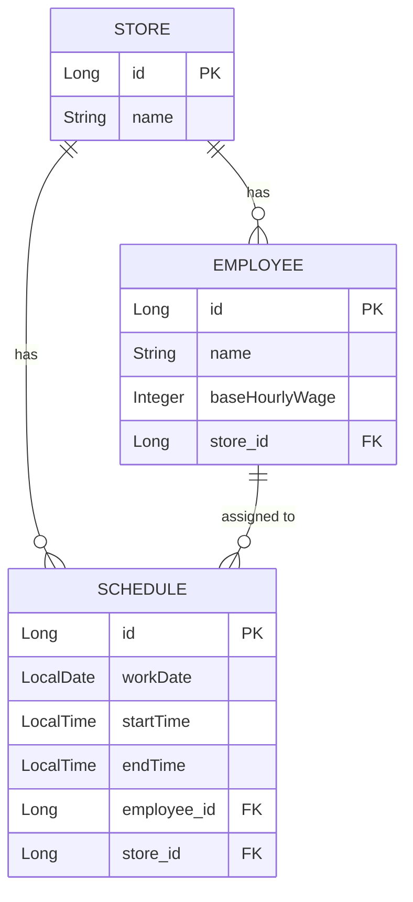

# Store Scheduler Backend
Spring Boot와 Python OR-Tools(CP-SAT Solver)를 결합한 교대근무 스케줄링 자동화 API 서버.
관리자의 스케줄링 리소스 최소화 및 근무자 제약 조건을 반영한 동적 근무표 산출.


## Tech Stack
- Backend: Java 17 / Spring Boot 3.x / Spring Data JPA
- Algorithm Engine: Python 3.x / Google OR-Tools
- Database: PostgreSQL
- Docs & Security: Swagger (Springdoc) / Spring Security / JWT


## System Architecture


- 이종 환경 통합: Spring Boot 내 `ProcessBuilder`를 이용한 Python 스크립트 독립 프로세스 실행.
- Data Pipeline: PostgreSQL ↔ Spring Boot ↔ Python Engine 간 JSON 기반 직렬화/역직렬화 통신.


## ERD & Directory Structure


### ERD



### Core Directory (Java & Python 통합)
```text
src/main/
 ├── java/com/example/store_scheduler_backend/
 │    ├── controller/      # Swagger 명세 및 API 엔드포인트
 │    ├── service/         # 파이썬 프로세스 호출 및 DB 영속화 로직
 │    └── security/        # JWT 토큰 발급 및 검증 로직
 └── resources/
      ├── application.yaml # DB, JWT 설정
      └── python/
           └── scheduler_core_0527.py  # OR-Tools 최적화 엔진
```

## Key Features

1. 알고리즘 기반 스케줄 최적화 (OR-Tools)
   - `연속 근무 불가`, `일일 최대 시간 제한` 등 하드 제약조건을 만족하는 최적해 산출.
2. 데이터 주도(Data-Driven) 동적 바인딩
   - 하드코딩 배제. DB의 `Employee(시급, 선호 시간)` 및 `Shift(교대근무 개수)` 데이터를 Python 엔진에 동적 할당.
3. 협업 친화적 인프라 (Swagger & CORS*
   - 프론트엔드 연동을 위한 전역 CORS 허용 및 Swagger-UI 기반 API 명세서 제공.


## Troubleshooting & Technical Decisions

### 1. Java-Python 프로세스 실행 환경 종속성 (Portability) 문제
- Issue: 초기 Python 스크립트 실행 경로가 로컬 PC의 절대 경로로 하드코딩되어, 타 환경 배포 및 협업 시 `FileNotFoundException` 발생.
- Solution: 스크립트를 프로젝트 내부(`src/main/resources/python/`)로 이식. OS 환경에 독립적인 상대 경로 및 표준 `python` 명령어 호출 방식으로 리팩토링하여 시스템 이식성 확보.

### 2. 하드코딩 탈피 및 동적 제약조건 주입 아키텍처 적용
- Issue: 파이썬 엔진 내부의 Base Hourly Wage(기본 시급) 및 Shift Index가 상수로 고정되어 확장성 저하.
- Solution: Spring Service 레이어에서 DB 데이터를 조회하여 매장 교대근무 사이즈에 맞춘 `Preferred Shifts` 인덱스를 동적으로 생성. 이를 JSON으로 파싱하여 Python 엔진 표준 입력으로 전달하도록 결합도 개선.

### 3. 양방향 연관관계 엔티티 직렬화 시 무한 참조(Infinite Recursion) 오류
- Issue: `Store`와 `Employee`, `Schedule` 엔티티 간의 1:N 양방향 연관관계가 설정된 상태에서, Python 최적화 엔진에 데이터를 전달하기 위해 Jackson 라이브러리로 JSON 직렬화를 수행하는 중 순환 참조가 발생하여 `StackOverflowError`로 인한 서버 다운 발생.
- Solution: `@JsonIgnore` 등 엔티티를 훼손하는 임시방편을 지양함. 대신 API 응답 및 Python 프로세스 데이터 전달을 위한 전용 **DTO(Data Transfer Object)**를 설계하여 적용. 엔티티를 직접 노출하지 않고 직렬화 계층을 분리함으로써 순환 참조를 원천 차단하고 시스템 안정성을 확보.


##  Branch Strategy

- `main`: 핵심 비즈니스 로직 및 배포 가능 안정화 버전
- `feat/security-jwt`: Spring Security 기반 Stateless 인증 및 JWT 파이프라인 (작업 중)


## Getting Started & API Docs

### Swagger API Documentation
서버 구동 후 즉각적인 API 테스트 및 명세 확인이 가능한 Swagger-UI 기반 API 명세서를 제공.


